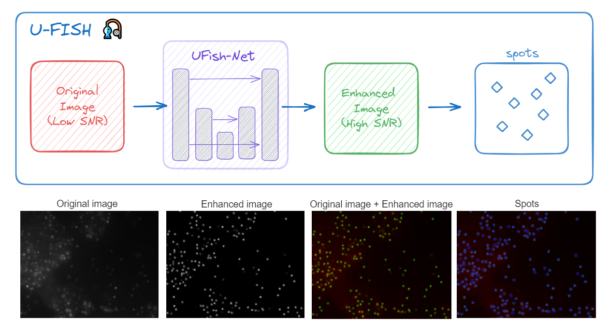

# U-FISH 🎣

U-FISH is an advanced FISH spot calling algorithm based on deep learning. The "U" in U-FISH represents both the U-Net architecture and the Unified output of enhanced images, underpinning our design philosophy.

<p>
  <a href="https://pypi.org/project/ufish/">
    
  </a>
</p>



U-FISH has been developed to address the challenges posed by significant variations in experimental conditions, hybridization targets, and imaging parameters across different data sources. These variations result in diverse image backgrounds and varying signal spot features. Conventional algorithms and parameter settings often fall short in accommodating the requirements of all these diverse image types. To overcome this limitation, we have devised a novel image enhancement approach based on the U-Net model, aimed at achieving a standardized output format for images.

Key points about U-FISH:

1. Diverse dataset: 4000+ images with approximately 1.6 million targets from seven sources, including 2 simulated datasets and 5 real datasets.
2. Small model: Achieve state-of-the-art performace with only 160k parameters (ONNX file size: 680kB).
3. 3D support: Support detection FIHS spots in 3D images.
4. Scalability: Support large-scale data storage formats: OME-Zarr and N5.
5. User-friendly interface: API, CLI, [Napari plugin](https://github.com/UFISH-Team/napari-ufish), and [web application](https://github.com/UFISH-Team/ufish-web).

## Installation

```bash
pip install ufish
```

For inference using GPU, you need to install onnxruntime-gpu:

```bash
pip install onnxruntime-gpu
```

### GPU support

For training using GPU, you need to install PyTorch with CUDA support, see [PyTorch official website](https://pytorch.org/) for details.

#### Windows and AMD GPU

If you are using Windows and AMD GPU, you need to install:

```bash
pip install torch-directml
```

## Usage

CLI usage:

```bash
# list all sub-commands:
$ python -m ufish

# using --help to see details of each sub-command, e.g.:
$ ufish predict --help

# predict one image
$ ufish predict input.tiff output.csv

# predict all images in a directory
$ ufish predict-imgs input_dir output_dir

# load a trained model and predict
$ ufish load-weights path/to/weights - predict-imgs input.tiff output.csv

# training from scratch
$ ufish train path/to/train_dir path/to/val_dir --model_save_dir path/to/save/model

# training from a pre-trained model (fine-tuning)
$ ufish load-weights path/to/weights - train path/to/train_dir path/to/val_dir --model_save_dir path/to/save/model
```

API for inference and evaluation:

```python
from skimage import io
from ufish.api import UFish

ufish = UFish()

# loading model weights
ufish.load_weights()
# or from a file
# ufish.load_weights("path/to/weights")
# or download from huggingface:
# ufish.load_weights_from_internet()

# inference
img = io.imread("path/to/image")
pred_spots, enh_img = ufish.predict(img)

# plot prediction result
fig_spots = ufish.plot_result(img, pred_spots)

# evaluate
true_spots = pd.read_csv("path/to/true_spots.csv")
metrics = ufish.evaluate_result(spots, true_spots)

# plot evaluation result
fig_eval = ufish.plot_evaluate(
    img, pred_spots, true_spots, cutoff=3.0)
```

API for training:

```python
from ufish.api import UFish

ufish = UFish()

# loading a pre-trained model
# if you want to train from scratch, just skip this step
ufish.load_weights("path/to/weights")

ufish.train(
    'path/to/train_dir',
    'path/to/val_dir',
    num_epochs=100,
    lr=1e-4,
    model_save_path='path/to/save/model',
)
```

## Dataset

The dataset is available at [HuggingFace Datasets](https://huggingface.co/datasets/GangCaoLab/FISH_spots):

```bash
# Make sure you have git-lfs installed (https://git-lfs.com)
git lfs install
git clone https://huggingface.co/datasets/GangCaoLab/FISH_spots
```

## TODO List

**Work in progress**

- [x] API
  - [x] Inference
  - [x] Evaluation
  - [x] Plotting tool for show TP, FP, FN
  - [x] Training
- [x] CLI
  - [x] Inference
  - [x] Evaluation
  - [x] Plotting tool for show TP, FP, FN
  - [x] Training
- [x] Add more datasets
  - [x] ExSeq
  - [x] MER-FISH
  - [x] seqFISH
- [x] Try other signal footprint
  - [x] Gaussian
  - [x] Single pixel prediction
- [x] Support for multi-channel images.
- [x] 3D integration method
  - [x] Stack 2D UEI to 3D, then apply local maxima.
  - [x] 3D blending: apply to xy, xz, yz planes, then blend.
- [x] Support for image chunks and zarr file format.
  - [x] Inference chunk by chunk.
  - [x] Read image from zarr/n5/ome-zarr file.
  - [x] Write UEI to zarr/n5/ome-zarr file.
- [ ] deploy
  - [x] setup.py
  - [x] upload model weights to huggingface
  - [x] upload package to PyPI
  - [ ] Upload to BioImageIO model zoo
- GUI
  - [x] Napari plugin
  - [ ] Web page
- [ ] Benchmarks
- [ ] Documentation
